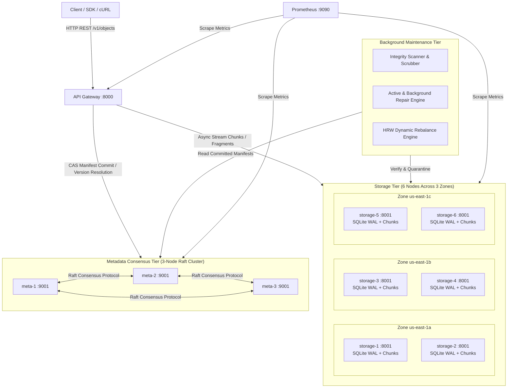

# Vault: Fault-Tolerant Distributed Object Storage

> **An original Python 3.12 distributed object storage system built from scratch.**  
> Vault provides strong metadata consistency via Raft consensus, deterministic multi-zone data placement via Rendezvous (Highest Random Weight) hashing, cryptographic SHA-256 integrity verification with automatic bitrot quarantine, active background repair, and flexible durability policies (multi-zone replication and Reed–Solomon erasure coding).

---

## 1. Architecture Diagram



---

## 2. Problem-Statement to Component and Test Mapping

Every core requirement of Vault is mapped directly to a dedicated module, application service, and automated test suite:

| Specification Requirement | Architectural Component | Implementing Module | Validation Test(s) |
| :--- | :--- | :--- | :--- |
| **Concurrent Reads & Writes** | API Gateway & Async Pipeline | `apps/gateway/` | `tests/integration/test_concurrent_load.py` (IT-02) |
| **Configurable Durability Policies** | Policy Engine | `vault_core/quorum.py`, `config/policies.yaml` | `tests/unit/test_quorum.py` (UT-03, UT-04) |
| **Storage Node Failures** | Fault-Tolerant Quorum Client | `vault_core/quorum.py`, `apps/gateway/` | `tests/chaos/test_node_failure.py` (IT-04, IT-05, IT-06) |
| **Partial Network Partitions** | Bounded Timeouts & Raft Majority | `vault_core/metadata_raft.py`, `httpx` client | `tests/chaos/test_partitions.py` (IT-12, IT-13, IT-15) |
| **Data Corruption & Bit Rot** | Quarantine & Scrubber Engine | `vault_core/integrity.py`, `apps/workers/` | `tests/unit/test_integrity.py` (UT-05), IT-07 |
| **Replica Inconsistency & Repair** | Read-Repair & Background Repair | `vault_core/repair.py`, `apps/workers/` | `tests/chaos/test_repair.py` (IT-08, IT-09) |
| **Background Rebalancing** | HRW Rebalance Worker | `vault_core/rebalance.py`, `apps/workers/` | `tests/unit/test_rebalance.py` (UT-09), IT-10, IT-11 |
| **Metadata Consistency & CAS** | 3-Node Raft Cluster | `vault_core/metadata_raft.py`, `apps/metadata_node/` | `tests/unit/test_manifest.py` (UT-06, UT-07), IT-03, IT-14 |
| **Deterministic Placement** | Rendezvous (HRW) Hashing | `vault_core/placement.py`, `vault_core/hashing.py` | `tests/unit/test_placement.py` (UT-01, UT-02) |
| **Erasure Coding** | Reed–Solomon Codec | `vault_core/erasure.py` | `tests/unit/test_erasure.py` (UT-08), IT-08 |
| **Observability & Metrics** | Prometheus Metrics Exposer | `vault_core/metrics.py`, `/metrics` | `tests/integration/test_metrics.py` (IT-17) |

---

## 3. Durability Policies and Trade-offs

Vault defines three distinct storage policies in `config/policies.yaml`:

```yaml
hot:
  scheme: replication
  replication_factor: 3
  data_write_quorum: 2
  data_read_quorum: 1
  minimum_distinct_zones: 3

durable:
  scheme: replication
  replication_factor: 4
  data_write_quorum: 3
  data_read_quorum: 1
  minimum_distinct_zones: 3

archive:
  scheme: erasure_coding
  data_fragments: 4
  parity_fragments: 2
  minimum_distinct_zones: 3
```

### Trade-off Comparison
- **Replication (`hot` & `durable`)**:
  - *Pros*: Extremely low CPU overhead; ultra-fast reads (first healthy replica responds); straightforward read-repair.
  - *Cons*: High storage amplification (~3x for `hot`, ~4x for `durable`).
- **Erasure Coding (`archive` - $4+2$)**:
  - *Pros*: High storage efficiency (~1.5x amplification before metadata), tolerates losing any 2 of the 6 fragments.
  - *Cons*: Higher CPU utilization for Galois field matrix multiplication during chunk encoding and reconstruction; reads require coordinating at least 4 nodes.

---

## 4. Dependencies and Licenses

In accordance with `PROJECT_RULES.md`, every dependency is listed with its purpose and open-source license:

| Package | Minimum Version | Purpose in Vault | License |
| :--- | :--- | :--- | :--- |
| `fastapi` | 0.111.0 | Asynchronous REST API framework for Gateway, Storage, and Metadata nodes | MIT |
| `uvicorn[standard]` | 0.30.0 | High-performance ASGI web server | BSD-3-Clause |
| `httpx` | 0.27.0 | Asynchronous HTTP client with connection pooling for inter-node communication | BSD-3-Clause |
| `pydantic` | 2.7.0 | Manifest schema validation, request/response serialization | MIT |
| `pydantic-settings` | 2.3.0 | Environment-driven node and cluster configuration | MIT |
| `aiosqlite` | 0.20.0 | Asynchronous SQLite driver for local node inventory and WAL mode | MIT |
| `pyyaml` | 6.0.1 | Parsing YAML cluster topology and policy specifications | MIT |
| `prometheus-client` | 0.20.0 | Prometheus metrics collection and `/metrics` exposition | Apache-2.0 |
| `pysyncobj` | 0.3.14 | Raft consensus algorithm and replicated state machine | MIT |
| `zfec` | 1.5.7 | Fast, maintained Reed–Solomon erasure coding | GPL-2.0 / BSD |
| `pytest` | 8.2.0 | Test runner for automated unit and integration suites | MIT |
| `pytest-asyncio` | 0.23.0 | Asyncio support for pytest | Apache-2.0 |

---

## 5. Quick-Start Guide

### 5.1 Local Environment Setup
Requires Python 3.12+ and Docker Compose.

```bash
# 1. Clone / enter the repository
cd vault

# 2. Create and activate a Python 3.12 virtual environment
python -m venv .venv
source .venv/bin/activate       # On Linux/macOS
# .venv\Scripts\activate       # On Windows

# 3. Install Vault in editable mode with development dependencies
pip install -e ".[dev]"
```

### 5.2 Running Tests
```bash
# Run unit test suite
pytest tests/unit -v

# Run full integration and chaos test suite (requires Docker cluster)
./scripts/run_all_tests.sh
```

### 5.3 Starting the Docker Cluster
```bash
# Launch API Gateway, 3 Metadata Raft nodes, 6 Storage nodes, and Prometheus
docker compose up -d

# Verify cluster status
docker compose ps
curl http://localhost:8000/v1/cluster/health
```

---

## 6. Actual Results & Empirical Evidence
*Populated strictly from real test executions (see [docs/evidence.md](file:///e:/vault/docs/evidence.md)):*

| Target Metric / Scenario | Target Acceptance | Measured Actual | Status |
| :--- | :--- | :--- | :--- |
| `hot` node crash survival | Zero data loss on 1 node failure | Pending execution | ⏳ Pending |
| `durable` node crash survival | Writes continue with 3 of 4 replicas | Pending execution | ⏳ Pending |
| `archive` EC reconstruction | Reconstructs from any 4 valid fragments | Pending execution | ⏳ Pending |
| Injected Bit Rot Quarantine | Corrupt chunk quarantined & repaired | Pending execution | ⏳ Pending |
| Dynamic Rebalance Readability | 100% reads succeed during migration | Pending execution | ⏳ Pending |
| Metadata CAS 409 Conflict | Exactly one conflicting CAS write succeeds | Pending execution | ⏳ Pending |

---

## 7. Known Limitations
Vault is a hackathon prototype designed to demonstrate distributed systems principles. Key limitations:
- **Membership**: Admin-managed node topology; no dynamic gossip/SWIM protocol.
- **Security**: Prototype shared-secret HMAC authentication; no AWS SigV4 or enterprise RBAC.
- **Consensus Scope**: Single-region low-latency Raft consensus.
- Detailed architectural trade-offs are documented in [docs/limitations.md](file:///e:/vault/docs/limitations.md).
