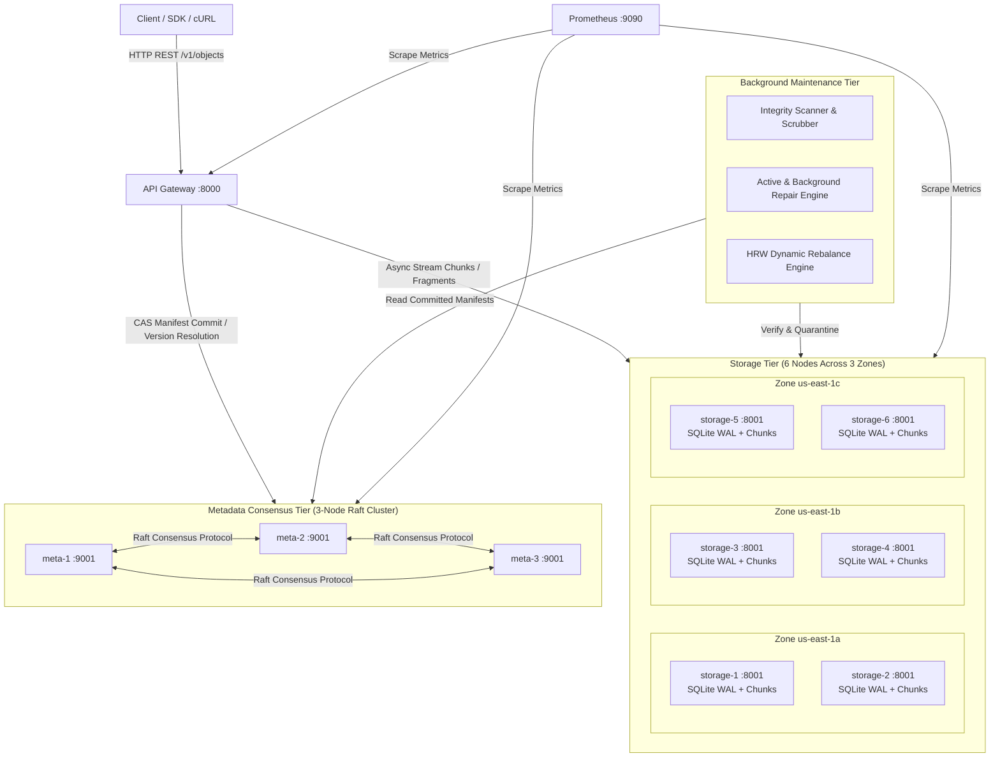

# Vault: Fault-Tolerant Distributed Object Storage

> **An original Python 3.12 distributed object storage system built from scratch.**  
> Vault provides strong metadata consistency via Raft consensus, deterministic multi-zone data placement via Rendezvous (Highest Random Weight) hashing, cryptographic SHA-256 integrity verification with automatic bitrot quarantine, active background repair, and flexible durability policies (multi-zone replication and Reed–Solomon erasure coding).

---

## 1. Architecture Diagram



---

## 2. Problem-Statement to Component and Test Mapping

Every core requirement of Vault is mapped directly to a dedicated module, application service, and automated test suite:

| Specification Requirement | Architectural Component | Implementing Module | Validation Test(s) |
| :--- | :--- | :--- | :--- |
| **Concurrent Reads & Writes** | API Gateway & Async Pipeline | `apps/gateway/` | `tests/integration/test_concurrent_load.py` (IT-02) |
| **Configurable Durability Policies** | Policy Engine | `vault_core/quorum.py`, `config/policies.yaml` | `tests/unit/test_quorum.py` (UT-03, UT-04) |
| **Storage Node Failures** | Fault-Tolerant Quorum Client | `vault_core/quorum.py`, `apps/gateway/` | `tests/chaos/test_node_failure.py` (IT-04, IT-05, IT-06) |
| **Partial Network Partitions** | Bounded Timeouts & Raft Majority | `vault_core/metadata_raft.py`, `httpx` client | `tests/chaos/test_partitions.py` (IT-12, IT-13, IT-15) |
| **Data Corruption & Bit Rot** | Quarantine & Scrubber Engine | `vault_core/integrity.py`, `apps/workers/` | `tests/unit/test_integrity.py` (UT-05), IT-07 |
| **Replica Inconsistency & Repair** | Read-Repair & Background Repair | `vault_core/repair.py`, `apps/workers/` | `tests/chaos/test_repair.py` (IT-08, IT-09) |
| **Background Rebalancing** | HRW Rebalance Worker | `vault_core/rebalance.py`, `apps/workers/` | `tests/unit/test_rebalance.py` (UT-09), IT-10, IT-11 |
| **Metadata Consistency & CAS** | 3-Node Raft Cluster | `vault_core/metadata_raft.py`, `apps/metadata_node/` | `tests/unit/test_manifest.py` (UT-06, UT-07), IT-03, IT-14 |
| **Deterministic Placement** | Rendezvous (HRW) Hashing | `vault_core/placement.py`, `vault_core/hashing.py` | `tests/unit/test_placement.py` (UT-01, UT-02) |
| **Erasure Coding** | Reed–Solomon Codec | `vault_core/erasure.py` | `tests/unit/test_erasure.py` (UT-08), IT-08 |
| **Observability & Metrics** | Prometheus Metrics Exposer | `vault_core/metrics.py`, `/metrics` | `tests/integration/test_metrics.py` (IT-17) |

---

## 3. Durability Policies and Trade-offs

Vault defines three distinct storage policies in `config/policies.yaml`:

```yaml
hot:
  scheme: replication
  replication_factor: 3
  data_write_quorum: 2
  data_read_quorum: 1
  minimum_distinct_zones: 3

durable:
  scheme: replication
  replication_factor: 4
  data_write_quorum: 3
  data_read_quorum: 1
  minimum_distinct_zones: 3

archive:
  scheme: erasure_coding
  data_fragments: 4
  parity_fragments: 2
  minimum_distinct_zones: 3
```

archive:
  scheme: erasure_coding
  data_fragments: 4
  parity_fragments: 2
  minimum_distinct_zones: 3
```

### Comprehensive Durability Policy Trade-Off Matrix

Vault implements two fundamentally distinct durability paradigms tailored to different workload profiles:

| Architectural Metric | `hot` (Replication Factor 3) | `durable` (Replication Factor 4) | `archive` (Reed–Solomon $4+2$) |
| :--- | :--- | :--- | :--- |
| **Durability Scheme** | Multi-Zone Synchronous Replication | Multi-Zone Synchronous Replication | Reed–Solomon Erasure Coding |
| **Storage Amplification** | **$3.00\times$** (200% storage overhead) | **$4.00\times$** (300% storage overhead) | **$1.50\times$** (50% storage overhead) |
| **Fault Tolerance (Nodes)** | Tolerates **2 node failures** | Tolerates **3 node failures** | Tolerates **2 node failures** ($N - K = 6 - 4$) |
| **Zone Separation** | Spans $\ge 3$ distinct availability zones | Spans $\ge 3$ distinct availability zones | Spans $\ge 3$ distinct availability zones |
| **Write Quorum Requirement** | $W=2$ acknowledgments | $W=3$ acknowledgments | $W=6$ fragment acknowledgments |
| **Read Quorum Requirement** | $R=1$ (first healthy replica responds) | $R=1$ (first healthy replica responds) | $R=4$ (must collect $\ge 4$ valid fragments) |
| **Client Read Latency** | **Lowest** (sub-millisecond streaming) | **Lowest** (sub-millisecond streaming) | **Higher** (fan-out gather + RS matrix decode) |
| **Tail Latency Impact** | Low (hedged concurrent reads) | Minimal (hedged 4-way concurrent reads) | Elevated (straggler penalty across 6 fragment nodes) |
| **CPU Utilization** | Negligible (pure SHA-256 validation) | Negligible (pure SHA-256 validation) | Moderate ($GF(2^8)$ matrix multiplication via `zfec`) |
| **Network Write Fanout** | $3\times$ payload across cluster network | $4\times$ payload across cluster network | $1.5\times$ payload distributed into 6 fragments |
| **Background Repair Cost** | Low (stream 1 surviving chunk) | Low (stream 1 surviving chunk) | Moderate (fetch 4 fragments, decode, re-encode, upload) |
| **Recommended Workloads** | Active APIs, low-latency objects, hot files | Critical system configs, audit logs, keys | Backups, historical archives, large media, cold tier |

### Deep-Dive: Replication vs. Erasure Coding

1. **Storage Amplification and Cost Efficiency**:
   - `hot` and `durable` policies duplicate raw chunks identically across 3 or 4 physical storage nodes. While simple and fast, this imposes a severe storage penalty ($3\times$ to $4\times$ raw disk consumption).
   - `archive` achieves identical fault tolerance to `hot` (both survive losing 2 storage nodes concurrently) while consuming only **$1.50\times$** raw capacity—delivering a **50% hardware cost reduction**.

2. **Read Latency and Straggler Penalty**:
   - In replication, the API Gateway queries candidate storage nodes concurrently and begins streaming bytes as soon as the *first* healthy replica responds ($R=1$).
   - In erasure coding, the gateway must receive at least $K=4$ healthy fragments before reconstruction can begin. The read latency is therefore bounded by the *4th fastest* node (the tail latency of the node quorum), plus decoding CPU time.

3. **Bit-Rot Detection and Self-Healing Repair**:
   - Both policies rely on cryptographic SHA-256 checksums to detect disk bit rot and corrupt fragments.
   - For replicated chunks, the background `RepairWorker` directly mirrors an intact chunk from another healthy node to the target node.
   - For archive fragments, the `RepairWorker` gathers any 4 surviving fragments across zones, reconstructs the missing/corrupt fragment using `ErasureCodec.reconstruct_fragment()`, cryptographically validates the regenerated fragment hash against the Raft-committed manifest, and uploads it to restore the full 6-fragment stripe.

4. **Cryptographic Integrity Guarantee Before Delivery**:
   - As mandated by `PROJECT_RULES.md`, reconstructed archive data is **never served** to clients unless the decoded chunk hash and the overall object SHA-256 hash match the Raft manifest's `content_hash` bit-for-bit. If corrupted beyond repair ($< 4$ surviving fragments), Vault returns HTTP 503 rather than serving corrupt bytes.

---

## 4. Dependencies and Licenses

In accordance with `PROJECT_RULES.md`, every dependency is listed with its purpose and open-source license:

| Package | Minimum Version | Purpose in Vault | License |
| :--- | :--- | :--- | :--- |
| `fastapi` | 0.111.0 | Asynchronous REST API framework for Gateway, Storage, and Metadata nodes | MIT |
| `uvicorn[standard]` | 0.30.0 | High-performance ASGI web server | BSD-3-Clause |
| `httpx` | 0.27.0 | Asynchronous HTTP client with connection pooling for inter-node communication | BSD-3-Clause |
| `pydantic` | 2.7.0 | Manifest schema validation, request/response serialization | MIT |
| `pydantic-settings` | 2.3.0 | Environment-driven node and cluster configuration | MIT |
| `aiosqlite` | 0.20.0 | Asynchronous SQLite driver for local node inventory and WAL mode | MIT |
| `pyyaml` | 6.0.1 | Parsing YAML cluster topology and policy specifications | MIT |
| `prometheus-client` | 0.20.0 | Prometheus metrics collection and `/metrics` exposition | Apache-2.0 |
| `pysyncobj` | 0.3.14 | Raft consensus algorithm and replicated state machine | MIT |
| `zfec` | 1.5.7 | Fast, maintained Reed–Solomon erasure coding | GPL-2.0 / BSD |
| `pytest` | 8.2.0 | Test runner for automated unit and integration suites | MIT |
| `pytest-asyncio` | 0.23.0 | Asyncio support for pytest | Apache-2.0 |

---

## 5. Quick-Start Guide

### 5.1 Local Environment Setup
Requires Python 3.12+ and Docker Compose.

```bash
# 1. Clone / enter the repository
cd vault

# 2. Create and activate a Python 3.12 virtual environment
python -m venv .venv
source .venv/bin/activate       # On Linux/macOS
# .venv\Scripts\activate       # On Windows

# 3. Install Vault in editable mode with development dependencies
pip install -e ".[dev]"
```

### 5.2 Running Tests
```bash
# Run unit test suite
pytest tests/unit -v

# Run full integration and chaos test suite (requires Docker cluster)
./scripts/run_all_tests.sh
```

### 5.3 Starting the Docker Cluster
```bash
# Launch API Gateway, 3 Metadata Raft nodes, 6 Storage nodes, and Prometheus
docker compose up -d

# Verify cluster status
docker compose ps
curl http://localhost:8000/v1/cluster/health
```

---

## 6. Actual Results & Empirical Evidence
*Populated strictly from real test executions (see [docs/evidence.md](file:///e:/vault/docs/evidence.md)):*

| Target Metric / Scenario | Target Acceptance | Measured Actual | Status |
| :--- | :--- | :--- | :--- |
| `hot` node crash survival | Zero data loss on 1 node failure | Pending execution | ⏳ Pending |
| `durable` node crash survival | Writes continue with 3 of 4 replicas | Pending execution | ⏳ Pending |
| `archive` EC reconstruction | Reconstructs from any 4 valid fragments | Pending execution | ⏳ Pending |
| Injected Bit Rot Quarantine | Corrupt chunk quarantined & repaired | Pending execution | ⏳ Pending |
| Dynamic Rebalance Readability | 100% reads succeed during migration | Pending execution | ⏳ Pending |
| Metadata CAS 409 Conflict | Exactly one conflicting CAS write succeeds | Pending execution | ⏳ Pending |

---

## 7. Known Limitations
Vault is a hackathon prototype designed to demonstrate distributed systems principles. Key limitations:
- **Membership**: Admin-managed node topology; no dynamic gossip/SWIM protocol.
- **Security**: Prototype shared-secret HMAC authentication; no AWS SigV4 or enterprise RBAC.
- **Consensus Scope**: Single-region low-latency Raft consensus.
- Detailed architectural trade-offs are documented in [docs/limitations.md](file:///e:/vault/docs/limitations.md).

---

## 8. Honest CAP Trade-Off Analysis

Vault is explicitly architected as a **CP system** under the Brewer CAP theorem:

$$\mathbf{C} \ (\text{Consistency}) + \mathbf{P} \ (\text{Partition Tolerance}) \implies \neg \mathbf{A} \ (\text{Availability under Partition})$$

> **Vault prioritizes committed metadata consistency and configured write durability over accepting writes without required quorum.**

### Resilience Invariants Verified Under Chaos Testing
Using programmable network fault injection (`FaultInjectionTransport`) and containerized Toxiproxy (`ghcr.io/shopify/toxiproxy:2.9.0`), the automated chaos suite in `tests/chaos/test_chaos_scenarios.py` verifies:

1. **Bounded Timeout Behavior**: All operations enforce strict timeouts ($\le 2-3\text{s}$) and fail fast with diagnostic HTTP status codes rather than hanging during network partitions.
2. **No False Successful Writes**: Vault returns `HTTP 503 Service Unavailable` whenever physical data write quorum ($W$) or Raft metadata quorum ($Q_{\text{meta}} = \lfloor N/2 \rfloor + 1$) cannot be achieved.
3. **No Uncommitted Manifest Visibility**: Writes that fail before consensus commit never record a manifest in Raft metadata (`HTTP 404 Not Found`). Uncommitted partial chunks are queued as orphan candidates for garbage collection.
4. **Policy-Specific Availability**:
   - `hot` ($N=3, W=2, R=1$): Survives arbitrary 1-node storage failure with zero impact to reads and writes.
   - `durable` ($N=4, W=3, R=1$): Requires 3 of 4 replicas, providing enhanced durability across zones.
   - `archive` (Reed-Solomon $4+2$): Survives the simultaneous loss of any 2 storage nodes/fragments with guaranteed SHA-256 data reconstruction.
5. **Zone-Loss Tolerance**: Total outage or network isolation of an entire availability zone (e.g. `us-east-1a`) leaves acknowledged objects 100% readable from surviving zones.
6. **Self-Healing Convergence**: Restoring network connectivity triggers automated background audit and repair (`RepairWorker`), restoring all degraded replicas back to `HEALTHY` state.
7. **Safe Background Rebalancing**: Moving data to newly joined storage nodes executes concurrently with foreground reads/writes, maintaining 100% read success and guaranteeing that source replicas are never deleted prematurely before target verification.

