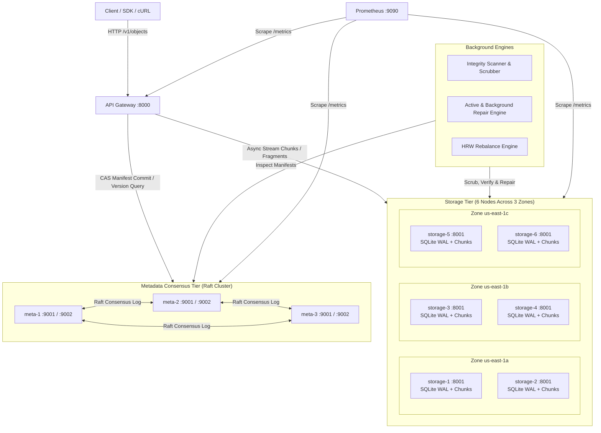

# Vault Architecture Specification

## 1. Overview
**Vault** is an original distributed object storage system designed for high durability, predictable availability, and strong metadata consistency across unreliable, independently failing storage nodes. Vault provides S3-like streaming object operations with cryptographic integrity verification, deterministic placement via Rendezvous hashing, Raft-based metadata consensus, and multiple durability policies (multi-zone replication and Reed–Solomon erasure coding).

---

## 2. System Topology

Vault comprises three primary tiers orchestrated via Docker Compose across at least three simulated availability zones (`us-east-1a`, `us-east-1b`, `us-east-1c`):

### Component Roles
1. **API Gateway (`apps/gateway`)**:
   - Exposes public REST endpoints (`PUT`, `GET`, `HEAD`, `DELETE`, `/health`, `/metrics`, `/cluster/health`).
   - Streams uploads and downloads without holding full objects in RAM (default chunk size: 8 MiB).
   - Generates immutable object version UUIDs and enforces logical version Compare-And-Swap (CAS).
   - Calculates deterministic chunk/fragment placement using Highest Random Weight (HRW) / Rendezvous hashing.
   - Dispatches parallel chunk writes/reads to storage nodes and coordinates quorum requirements.
   - Commits finalized manifests to the Raft metadata cluster.

2. **Metadata Consensus Cluster (`apps/metadata_node` & `vault_core/metadata_raft.py`)**:
   - 3-node Raft replicated state machine ensuring strict serializability of object manifests, tombstones, and cluster membership.
   - Survives 1 node crash/partition while maintaining full read/write quorum ($N=3, Q=2$).
   - Guarantees that uncommitted writes are never visible and conflicting concurrent writes with the same logical version result in an HTTP 409 Conflict.

3. **Storage Nodes (`apps/storage_node`)**:
   - 6 standalone nodes, each equipped with its own dedicated Docker volume and local SQLite database (`aiosqlite`) running in WAL mode.
   - Stores immutable, content-addressed versioned chunk and fragment files (`data/<bucket>/<version>_<chunk_idx>`).
   - Validates SHA-256 checksums before accepting incoming writes and prior to serving read requests.
   - Automatically isolates corrupt chunks into a dedicated quarantine directory upon checksum mismatch.

4. **Background Workers (`apps/workers`)**:
   - **Integrity Scanner**: Continuously scrubs local chunk storage against SQLite inventory and manifest records.
   - **Repair Worker**: Consumes under-replicated or degraded chunk alerts and reconstructs replicas/fragments from surviving nodes.
   - **Rebalance Worker**: Adjusts data distribution following node addition/deactivation without degrading foreground request latency.

---

## 3. Durability Policies & Placement

Placement is governed by Highest Random Weight (HRW) hashing evaluated over `(bucket, key, version, chunk_index, node_id)`. Placement strictly enforces **zone separation** before node separation: no two replicas or fragments of the same chunk may reside in the same failure domain if distinct domains are available.

| Policy | Scheme | Placement Formula | Quorum (Write/Read) | Min Distinct Zones | Storage Amplification | Trade-off |
| :--- | :--- | :--- | :--- | :--- | :--- | :--- |
| **`hot`** | Replication | 3 replicas across 3 zones | $W=2, R=1$ | 3 zones | ~3.0x | Minimal latency, fast read repair, medium overhead |
| **`durable`** | Replication | 4 replicas across 3 zones | $W=3, R=1$ | 3 zones | ~4.0x | High fault tolerance (survives 2 node losses), high storage overhead |
| **`archive`**| Reed–Solomon EC | 4 Data + 2 Parity (6 fragments) | $W=6, R=4$ | 3 zones | ~1.5x | Minimal storage overhead, CPU cost for Galois matrix math, reconstructs from any 4 fragments |

---

## 4. End-to-End Operation Flows

### 4.1 Write Flow (PUT)
1. **Initialize Version**: Gateway contacts Raft metadata cluster to reserve or prepare a versioned object record with precondition check.
2. **Chunking & Streaming**: Gateway receives payload stream, splitting into 8 MiB chunks.
3. **Placement Calculation**: For each chunk, Gateway executes Rendezvous hashing to select target storage nodes, enforcing zone diversity.
4. **Data Encoding (if EC)**: For `archive` policy, Reed–Solomon encodes chunk into $4+2$ fragments.
5. **Parallel Storage Write**: Gateway streams chunks/fragments concurrently to target nodes. Storage nodes verify streaming SHA-256 before acknowledging.
6. **Data Quorum Verification**: Gateway checks whether required data write quorum ($W$) was satisfied.
7. **Raft Manifest Commit**: Gateway commits complete manifest (containing chunk hashes, placement list, content hash, version, and idempotency key) via Raft.
8. **Enforce Visibility**: The object is visible to GET/HEAD requests only after Raft confirms log commitment.

### 4.2 Read Flow (GET)
1. **Manifest Resolution**: Gateway fetches committed manifest from Raft cluster.
2. **Candidate Selection**: Gateway identifies placement nodes recorded in the manifest.
3. **Concurrent Retrieval**:
   - *Replication*: Gateway requests chunk from nearest/fastest active node. If checksum fails or node is unreachable, it falls back to surviving replicas and enqueues a read-repair.
   - *Erasure Coding*: Gateway fetches at least $K=4$ valid fragments in parallel, reconstructs original chunk bytes, and verifies chunk SHA-256.
4. **Stream to Client**: Gateway streams verified bytes directly to client.

### 4.3 Delete Flow (DELETE)
1. **Tombstone Commit**: Gateway commits a versioned tombstone manifest through Raft consensus.
2. **Immediate Invisibility**: Subsequent GET/HEAD requests instantly return 404 Not Found.
3. **Asynchronous Garbage Collection**: Background worker safely reclaims underlying chunk files on storage nodes only after the configured retention period expires.
